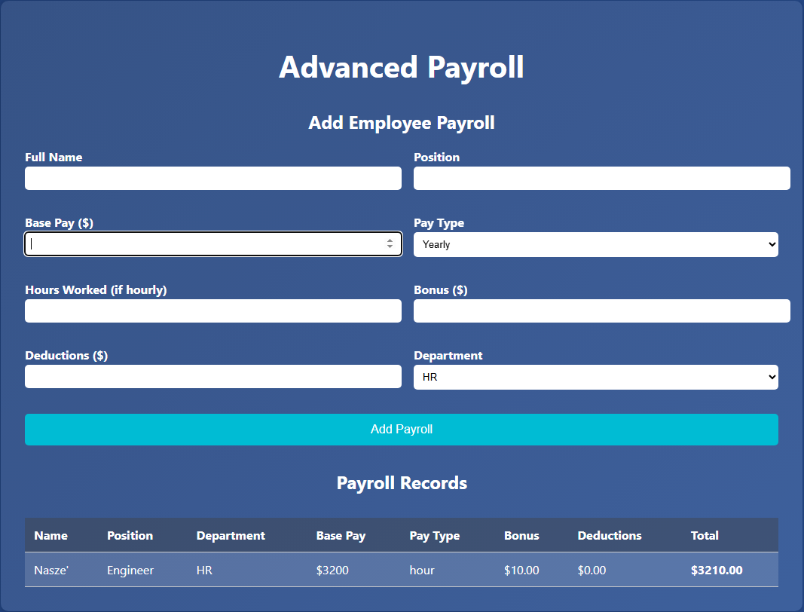
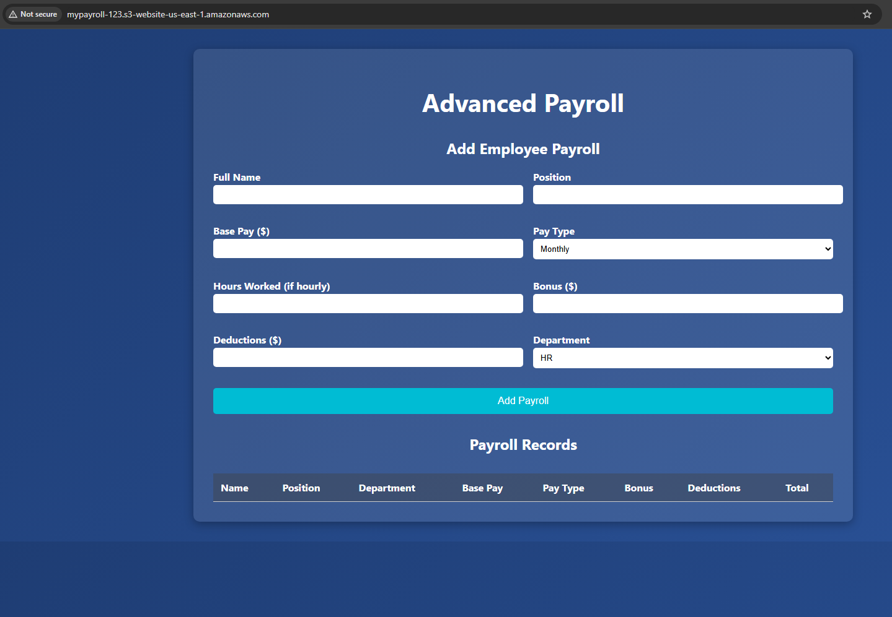

## PayrollApp
A powerful, single-file PayRoll App with advanced features like employee records, employee payrolls and multi-tab support.

## Features
- Add Employee Payroll
- Edit Payroll
- Remove Employee Payrolls
- Payroll Records

## Demo

## How to run
1. `app` > `index.html`
2. Right click `index.html`
3. `Open with Live Server`

## Technologies
- HTML
- CSS
- JavaScript
- AWS S3 Bucket

## LICENSE
This project is licensed under the [MIT License](LICENSE)

## AWS Deployment
Deployed the PayrollApp on AWS using the S3 Bucket

## Post AWS DEployment

